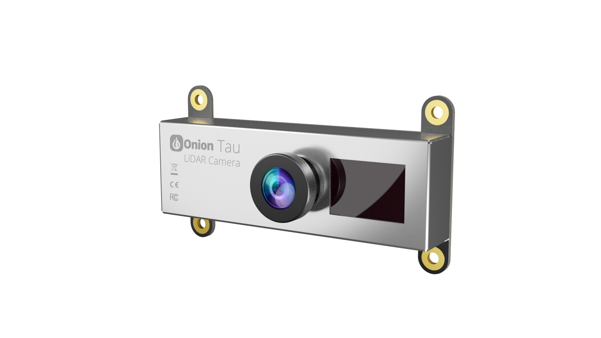

# TauLidarCamera
Python API for the Onion Tau Lidar Camera



## Main Features

TauLidarCamera is the host-side API for building applications with the Tau LiDAR Camera.

* Connecting to the camera
* Configuring camera settings
* Retrieving frames from the camera. Frames can be:
  * Depth data
  * Greyscale image data
  * Light amplitude data

## Installation & Supported Versions

Install using pip on the command line:

```
python -m pip install TauLidarCamera
```

Supports Python 3.6.1+

## API Reference & Documentation

Documentation & API reference can be found online: TODO

## Examples

Example programs using the Tau Lidar Camera and the TauLidarCamera Python module can be found in the [`examples` directory](./examples).

## Contributing to Development

See the [development document](DEVELOPMENT.md) for instructions on local development.

More info on contributing coming soon!
