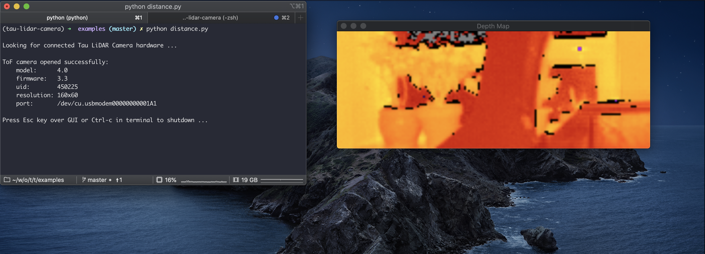
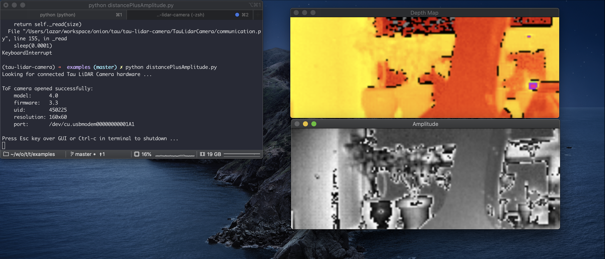
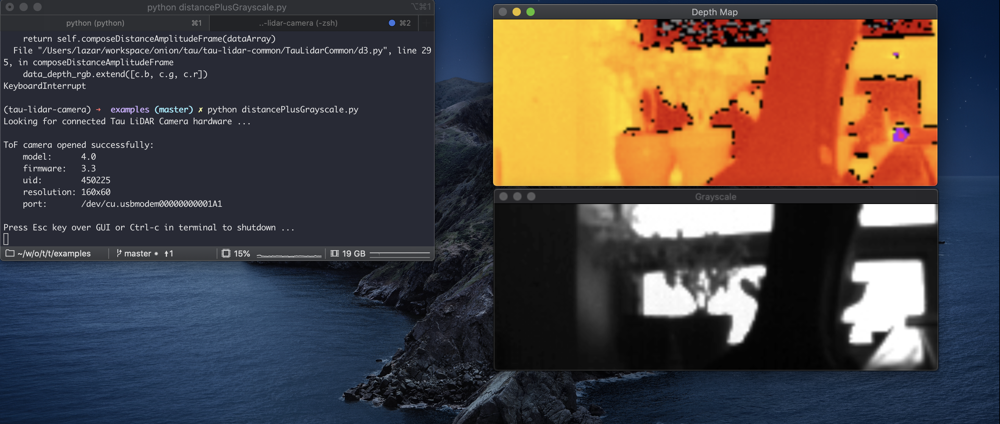
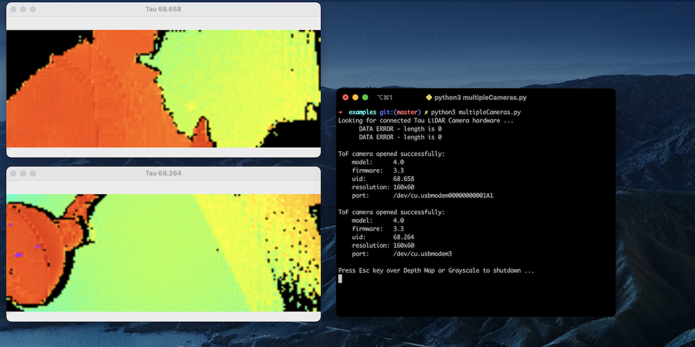
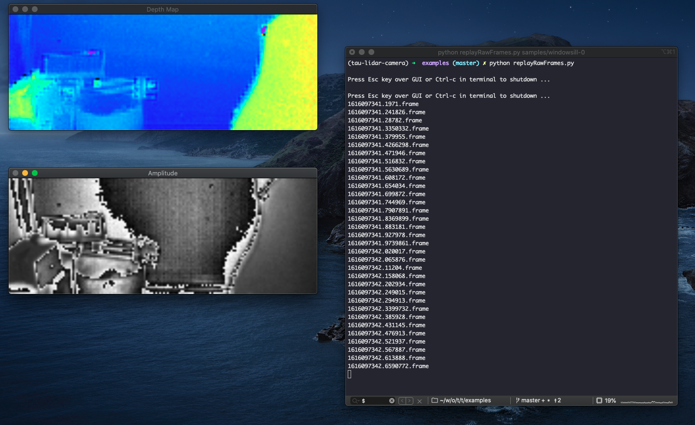

# Examples

Samples of programs that use the Tau LiDAR Camera, each demonstrating the functionality of the TauLidarCamera Python module.


* [`distance.py`](#distancepy)
* [`distancePlusAmplitude.py`](#distanceplusamplitudepy)
* [`distancePlusGrayscale.py`](#distanceplusgrayscalepy)
* [`multipleCameras.py`](#multiplecameraspy)
* [Record and Playback Frames](#record-and-playback-frames)
  + [Recording Frames with `recordRawFrames.py`](#recording-frames-with-recordrawframespy)
  + [Replaying Recorded Frames with `replayRawFrames.py`](#replaying-recorded-frames-with-replayrawframespy)
  + [An Example](#an-example)
  + [Next Steps](#next-steps)
* [`checkCamera.py` Program](#checkcamerapy-program)
  + [How to Run](#how-to-run-6)
    - [Mode 1 - Scanning All Ports](#mode-1---scanning-all-ports)
    - [Mode 2 - Specifying a Port](#mode-2---specifying-a-port)


## `distance.py`

### What this demonstrates

The sample program demonstrates acquiring frames with distance / depth information only.

### Pre-requisites

Pre-requisites/dependencies:

  #### TauLidarCamera python module:

    #pip install TauLidarCamera

  #### OpenCV python module

    #pip install opencv-python


### How to Run

Command to run the program:

```    
#python distance.py
```

A new window rendering the 2D depth map will open:



## `distancePlusAmplitude.py`

### What this demonstrates

The sample program demonstrates acquiring frames with both distance / depth and amplitude image.

### Pre-requisites

Pre-requisites/dependencies:

  #### TauLidarCamera python module:

    #pip install TauLidarCamera

  #### OpenCV python module

    #pip install opencv-python

### How to Run

Command to run the program:

```    
#python distancePlusAmplitude.py
```

Two new windows will open to show the depth map and amplitude coming from the camera:



## `distancePlusGrayscale.py`

### What this demonstrates

The sample program demonstrates acquiring frames with both distance / depth and grayscale image.

### Pre-requisites

Pre-requisites/dependencies:

  #### TauLidarCamera python module:

    #pip install TauLidarCamera

  #### OpenCV python module

    #pip install opencv-python

### How to Run

Command to run the program:

```
#python distancePlusGrayscale.py
```  

Two new windows will open to show the depth map and grayscale image coming from the camera:



## `multipleCameras.py`

### What this demonstrates

Rendering depth data from **ALL connected** Tau Cameras in real-time. You are only limited by the number of USB ports!

### Pre-requisites

Pre-requisites/dependencies:

  #### TauLidarCamera python module:

    #pip install TauLidarCamera

  #### OpenCV python module

    #pip install opencv-python


### How to Run

Command to run the program:

```
#python multipleCameras.py
```  

A new window for each connected camera will open, showing the depth map coming from each:



## Record and Playback Frames

These two example programs demonstrate using the Tau Camera to capture and store depth data, and then later playback the recording.

The recording program is very lightweight - minimal use of libraries and minimal processing of data - so it can run smoothly on lower power devices like the Omega2. Very useful if your application makes it difficult to have your Tau Camera tethered to a full computer at all times.

We've also made an example frame recording available. Check out the [example section](#an-example) below. **You don't need to have the Tau Camera hardware to try this out!**


### Recording Frames with `recordRawFrames.py`

Capture raw frames (binary bitstream) coming from the Tau Camera and write each frame to a file.

> This program is written to be as lightweight as possible - minimal use of libraries and minimal processing of data - so it can run smoothly on lower power devices like the Omega2

#### Pre-requisites

Pre-requisites/dependencies:

  #### TauLidarCamera python module:

    #pip install TauLidarCamera

#### How to Run

Command to run the program:

```
#python recordRawFrames.py
```  

Once it detects and initializes the camera, it will start capturing frames and writing them to disk. The frame files will be named according to the timestamp and placed in a new `samples` directory - for example: `samples/1616098779.62342.frame`

To stop capturing frames, press **Ctrl+C** in the terminal. You will see a `Shutting down ...` message.


### Replaying Recorded Frames with `replayRawFrames.py`

The `replayRawFrames.py` program allows you to **play back** any frames you've recorded. It will render the 2D depth map and amplitude view (using OpenCV) from each captured frame.

> You don't need the Tau Camera to run this program, just the recorded frames! Check out the example below to find out where to get some example frames.

#### Pre-requisites

Pre-requisites/dependencies:

  #### TauLidarCamera python module:

    #pip install TauLidarCamera

  #### OpenCV python module

    #pip install opencv-python

And some recorded frames

#### How to Run

Command to run the program:

```
#python replayRawFrames.py
```  

Two new windows will open. They will render the 2D depth map and amplitude view for each frame one by one:



By default it will read all of the frames in the `samples` directory (in this `examples` directory). The program will end and the OpenCV windows will close when all of the frames have been played back.

#### Optional Argument

To point the playback to a different directory, run the program with an argument:

```
#python replayRawFrames.py <DIRECTORY WITH FRAMES>
```

### An Example

We've recorded a small selection of frames so you can test this out even if you don't have a Tau Camera. Follow along to try playing back frames on your own computer.

1. Grab the example programs by cloning the [tau-lidar-camera GitHub repo](https://github.com/OnionIoT/tau-lidar-camera) to your computer:
  ```
  git clone https://github.com/OnionIoT/tau-lidar-camera.git
  ```
2. Navigate to the `examples` directory
  ```
  cd tau-lidar-camera/examples
  ```
3. Make sure you have Python3.7 or higher and the [pre-requisites for `replayRawFrames.py`](#pre-requisites-5) installed
4. Download this zip file of recorded frames: https://onion-downloads.s3-us-west-2.amazonaws.com/tau/sample-frames/tau-frames-windowsill-0.zip
5. Unzip it and you'll have a new `windowsill-0` directory
6. Run the playback program and point it to the `windowsill-0` directory:
  ```
  #python replayRawFrames.py windowsill-0
  ```

For reference, a regular photo of the windowsill can be found at `windowsill-0/rgb-photo`. Take a look and see how it compares to the Tau's recorded frames!


### Next Steps

A few ideas on what to do next:

* Try playing with the parameters passed to `Camera.setRange()` in the `replayRawFrames.py` program and see how it changes the 2D depth map
* If you have the Tau Camera hardware, try recording your own frames and playing them back!
* The record frames program is very lightweight, it can run on systems like the Onion Omega2. You can try using an Omega2 with a Tau Camera to capture frames and then play them back over your network 😉
* **Try building on top of these example programs.** They're a solid foundation for your own, more complete record and playback implementation -- very useful if you don't want your Tau Camera to be tethered to a full computer at all times.

## `checkCamera.py` Program

### What this demonstrates

This sample program is meant to help debug any issues with connecting to a Tau LiDAR Camera.

It operates in two modes:

1. Scanning all serial ports to determine if there's any connected Tau LiDAR Cameras. If so, connect to the first available Camera.
2. The serial port for Tau Camera is specified as an argument, and the program will only attempt to connect to a Tau LiDAR Camera on that serial port

When debugging your connection issues, first try running the program in the first mode where it scans all serial ports. You will get some idea of what's going on based on the command line output.

When you've narrowed down which

### Pre-requisites

Pre-requisites/dependencies:

  #### TauLidarCamera python module:

    #pip install TauLidarCamera

  #### OpenCV python module

    #pip install opencv-python


### How to Run

#### Mode 1 - Scanning All Ports

Command to run the program so that it scans all serial ports:

```    
#python checkCamera.py
```

If there is a Tau Camera connected and working properly, the program will output something like:

```
Looking for connected Tau LiDAR Camera hardware ...

Found 1 possible device(s)
Attempting to connect to device on port '/dev/cu.usbmodem00000000001A1'

ToF camera opened successfully:
    model:      4.0
    firmware:   3.3
    uid:        450225
    resolution: 160x60
    port:       /dev/cu.usbmodem00000000001A1

Press Esc key over GUI or Ctrl-c in terminal to shutdown ...
```

And a new window rendering the 2D depth map will open.

This output is helpful because it shows:

- How many possible Tau Camera devices were found
- Which serial port the program is using to connect to the Camera

##### Unsuccessful Connection

If no Tau Camera devices are detected, expect to see output like this:

```
Looking for connected Tau LiDAR Camera hardware ...
No Tau Camera devices found, please check:
1. If Tau Camera is connected;
2. If current user has permission to access all serial ports.

Found 0 possible device(s)
```

#### Mode 2 - Specifying a Port

Command to run the program so that the serial port for the Tau Camera connection is specified:

```    
#python checkCamera.py --port <serial port>
```

For example, say you have a Tau Camera on port `/dev/cu.usbmodem00000000001A1`. The command would be:

```
python checkCamera.py --port /dev/tty.usbmodem00000000001A1
```

If there is a Tau Camera connected and working properly, the program will output something like:

```
Attempting to connect to device on port '/dev/tty.usbmodem00000000001A1'

ToF camera opened successfully:
    model:      4.0
    firmware:   3.3
    uid:        450225
    resolution: 160x60
    port:       /dev/tty.usbmodem00000000001A1

Press Esc key over GUI or Ctrl-c in terminal to shutdown ...
```

And a new window rendering the 2D depth map will open.


##### Unsuccessful Connection

If the connection to the Tau Camera is not successful, expect to see output that looks something like this:

```
Attempting to connect to device on port '/dev/tty.usbmodem00000000001A1'
Traceback (most recent call last):
  File "/Users/lazar/workspace/onion/tau/tau-lidar-camera/lib/python3.8/site-packages/

...

Exception: Failed connecting to the serial port /dev/tty.usbmodem00000000001A1, please check:
1. If Tau Camera is connected;
2. If current user has permission to access the port
```

Try following the message from the output: double-check if the Tau Camera is indeed connected, and check if the current user has permission from the system to access the specified serial port.
